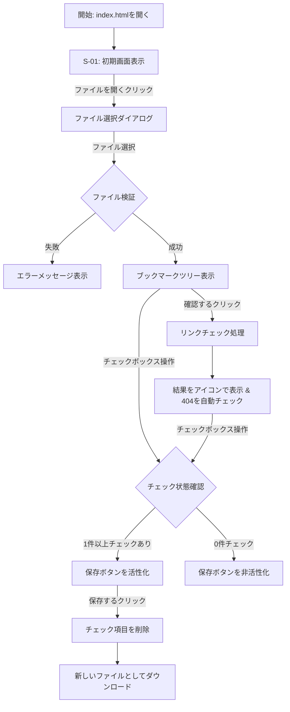

### 外部仕様書.md

## Google Chromeブックマーク整理アプリケーション 外部仕様書

**文書バージョン:** 1.0
**作成日:** 2025/06/12
**対象読者:** 開発担当者, テスト担当者

### 1. はじめに

#### 1.1. 本書の目的
本書は、「Google Chromeブックマーク整理アプリケーション 要件定義書」に基づき、アプリケーションの画面仕様、機能仕様、および非機能仕様を詳細に定義することを目的とします。開発者は本書に従って実装を行ってください。

#### 1.2. アプリケーション概要
ローカルのChromeブックマークファイルを読み込み、リンク切れのチェックと不要なブックマークの削除を支援するクライアントサイド完結型のWebアプリケーションです。

### 2. システム仕様

- **種別:** 静的Webアプリケーション
- **フロントエンド:** TypeScript, HTML, CSS
- **実行環境:** ローカルマシン上のWebブラウザ

### 3. 画面仕様

#### 3.1. 画面一覧
| 画面ID | 画面名 | URLパス | 概要 |
| :--- | :--- | :--- | :--- |
| S-01 | ブックマーク管理画面 | (ローカルファイルパス) | ファイル選択、ブックマーク表示、リンクチェック、保存の全機能を提供する。 |

#### 3.2. 画面フロー図

#### 3.3. 画面詳細 (S-01: ブックマーク管理画面)

- **画面レイアウト:**
    - **ヘッダーエリア:** 操作ボタンを配置。
    - **コンテンツエリア:** ブックマークツリーを表示。
    - **フッター/ステータスエリア:** 処理中の進捗表示やメッセージを表示。

- **コンポーネント詳細:**
    1.  **ファイル選択ボタン (`<input type="file" id="file-input">` と `<button>`):**
        -   ユーザーがクリックするためのボタンと、実際のファイル選択をハンドルする非表示のinput要素で構成する。
        -   `accept=".json"` 属性を指定し、JSONファイルのみ選択できるように促すことが望ましい。

    2.  **確認ボタン (`<button id="check-links-button">`):**
        -   クリックすると、F-06のリンク一括チェック機能をトリガーする。
        -   ファイルが読み込まれるまでは非活性（`disabled`）とする。

    3.  **保存ボタン (`<button id="save-button">`):**
        -   初期状態およびチェック項目が0件の場合は非活性（`disabled`）。
        -   1件以上のブックマークがチェックされると活性化する。

    4.  **ブックマークコンテナ (`
`):**
        -   読み込まれたブックマークツリーが描画される領域。
        -   フォルダは `
` や `<ul>` で、ブックマーク項目は `<li>` などで階層構造を表現する。
        -   **ブックマーク項目 (`<li class="bookmark-item">`):**
            -   **チェックボックス (`<input type="checkbox">`):** 選択用。
            -   **サイト名 (``):** ブックマークの`name`プロパティを表示。
            -   **結果アイコン (``):** リンクチェック結果（😊, 💀, ❓）を表示する領域。初期状態は空。

    5.  **ステータス表示エリア (`
`):**
        -   リンクチェック中のプログレスバーや、「チェック中: 50 / 1200」のような進捗テキストを表示する。
        -   エラーメッセージや完了メッセージもこのエリアに表示する。

### 4. 機能仕様

#### 4.1. ファイル読み込み (F-02, F-03)
1.  **トリガー:** `file-input` の `change` イベント。
2.  **処理フロー (TypeScript):**
    1.  `FileReader` APIを使用して、選択されたファイルをテキストとして読み込む。
    2.  `JSON.parse()` でJSONオブジェクトに変換する。`try-catch`構文でパースエラーを捕捉する。
    3.  パース成功後、オブジェクトが `roots.bookmark_bar` や `roots.other` といったプロパティを持つか確認し、Chromeブックマークの形式か簡易検証する。
    4.  検証に失敗した場合、`status-area`にエラーメッセージを表示して処理を中断する。
    5.  成功した場合、F-04のツリー描画処理を呼び出す。

#### 4.2. ブックマークツリー表示 (F-04)
1.  **トリガー:** ファイル読み込み成功時。
2.  **処理フロー (TypeScript):**
    1.  `bookmark-tree-container` の内容をクリアする。
    2.  パースしたJSONオブジェクトを引数に取り、再帰的にDOM要素を生成する関数を定義する。
    3.  オブジェクトの `type` プロパティが `folder` であればフォルダ用のDOM（例: `<ul>`）を、`url` であればブックマーク項目用のDOM（例: `<li>`）を生成する。
    4.  ブックマーク項目には、チェックボックス、サイト名(`name`)、ステータスアイコン用の``を含める。
    5.  生成したDOMツリーを `bookmark-tree-container` に追加する。

#### 4.3. リンク一括チェック (F-06, F-07, F-08, F-09)
1.  **トリガー:** `check-links-button` の `click` イベント。
2.  **処理フロー (TypeScript):**
    1.  画面上の全ブックマーク項目からURLのリストを収集する。
    2.  `status-area` にプログレスバーと進捗テキストを表示し、操作ボタンを一時的に無効化する。
    3.  URLリストをループし、各URLに対して `fetch(url, { method: 'HEAD', mode: 'no-cors' })` を実行する。
        -   *補足: `HEAD`リクエストはヘッダーのみ取得するため高速。`mode: 'no-cors'` はCORSエラーを回避するが、レスポンスの詳細（ステータスコード等）は取得できない不透明なレスポンスとなる。このため、単純な疎通確認に留まる。より正確なステータスコードを得るには、CORSプロキシを立てるか、ブラウザ拡張機能として実装する必要があるが、本仕様では `no-cors` を前提とする。その場合、成功/失敗の2値での判定となる。*
        -   **【代替案/推奨仕様】** 要件の（8,9,10）を実現するにはステータスコードが必要なため、`fetch`を単純に実行し、CORSエラーが発生した場合は「❓」として扱う方針とする。
    4.  `Promise.allSettled` を使用して、すべての`fetch`リクエストが完了するのを待つ。
    5.  各リクエストの結果を判定する。
        -   `fulfilled` かつ `response.ok` (status 200-299): 対応する項目のアイコンを「😊」にする。
        -   `fulfilled` かつ `response.status === 404`: アイコンを「💀」にし、チェックボックスの `checked` プロパティを `true` にする。
        -   `rejected` (ネットワークエラー等) または上記以外のステータス: アイコンを「❓」にする。
    6.  全処理完了後、`status-area` に完了メッセージを表示し、ボタンの無効化を解除する。
    7.  チェックボックスの状態が変更されたため、F-10の保存ボタン制御処理を呼び出す。

#### 4.4. ファイル保存 (F-11, F-12)
1.  **トリガー:** `save-button` の `click` イベント。
2.  **処理フロー (TypeScript):**
    1.  画面上のチェックボックスが `checked` になっているブックマーク項目のID（または一意な識別子）をリストアップする。
    2.  ファイル読み込み時に保持しておいた元のJSONオブジェクトをディープコピーする。
    3.  コピーしたオブジェクトに対し、再帰的な関数を用いて、リストアップしたIDに一致するブックマークオブジェクトを削除する。
    4.  処理後のJSONオブジェクトを `JSON.stringify(obj, null, 2)` で整形された文字列に変換する。
    5.  `new Blob([jsonString], { type: 'application/json' })` でBlobオブジェクトを生成する。
    6.  `URL.createObjectURL(blob)` でURLを生成し、`<a>` タグを動的に作成。`href`属性にこのURLを、`download`属性にファイル名（例: `Bookmarks_20250612.json`）を設定して `click()` を実行し、ダウンロードを開始する。

### 5. 非機能仕様

#### 5.1. パフォーマンス
- リンクチェックは並列実行数を制限する（例: 一度に10リクエストずつ）ことで、ブラウザやネットワークへの負荷を軽減することを検討する。`Promise`ベースのキューを実装することで実現可能。

#### 5.2. エラーハンドリング
- **ファイル読み込みエラー:** `FileReader` の `onerror` イベントや `JSON.parse` の `catch` 節でエラーを捕捉し、ユーザーに通知する。
- **リンクチェックエラー:** `fetch` が失敗した場合（`Promise`の`reject`）も、処理を中断せず、該当項目を「❓」として扱う。`Promise.allSettled` の利用によりこれを実現する。

### 6. 外部インターフェース仕様

#### 6.1. Chromeブックマークファイル
- **形式:** JSON
- **構造:** ルートオブジェクトに `roots` というキーがあり、その下に `bookmark_bar`, `other`, `synced` という3つの主要なフォルダオブジェクトが存在する。各オブジェクトは再帰的なツリー構造を持つ。
    - **フォルダオブジェクト:** `{ "date_added": "...", "id": "...", "name": "...", "type": "folder", "children": [...] }`
    - **ブックマークオブジェクト:** `{ "date_added": "...", "id": "...", "name": "...", "type": "url", "url": "..." }`
- アプリケーションは、この構造を前提としてデータの読み込み、解析、変更、出力を行う。